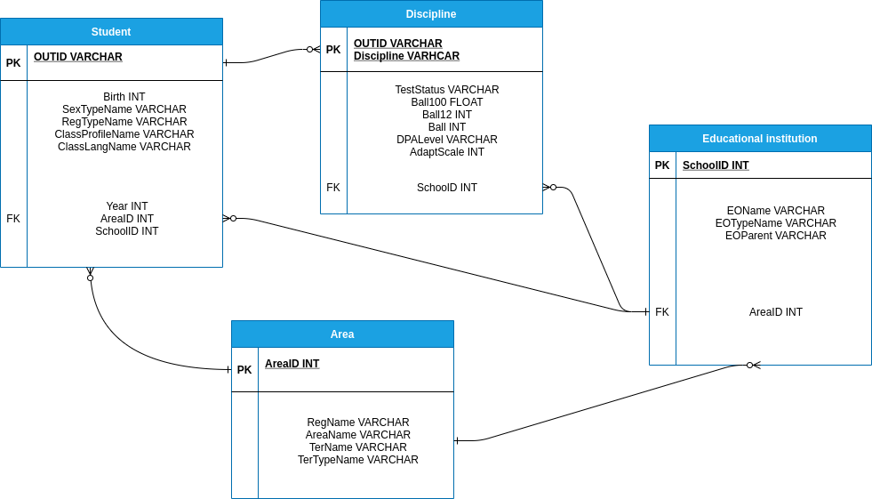
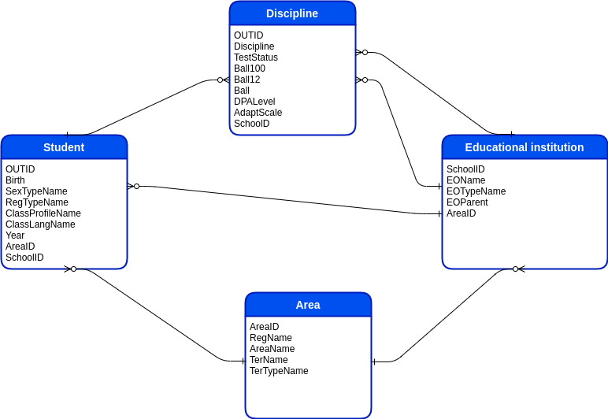

<h2>Лабораторна робота №1 студента групи КМ-81 Волинця Сергія</h2>

<p>Перед виконанням програми додайте в кореневу папку файли зі ЗНО за 
2019-2020 роки, та сконфігуруйте файл .env під вашу систему.
Для цього необхідно заповнити наступні поля:</p>
<ol>
  <li>db=''- назва Вашой БД</li>
  <li>user='' - ім'я користувача</li>
  <li>password='' - пароль для користувача</li>
  <li>url='localhost' - тут можна вставити айпішник Вашої машини</li>
  <li>zno2020='' - шлях до файлу з результатами ЗНО за 2020</li>
  <li>zno2019='' - шлях до файлу з результатами ЗНО за 2019</li>
  <li>table=''- назва таблиці</li>
 </ol>

<h3>Запуск програми</h3>
<p>Для всіх варіантів ОС треба виконати:</p>

```
docker-compose up
```

Далі запуск відрізняється залежно від системи. GNU/Linux Для того щоб запустити:
```
python3 -m pip install virtualenv
python3 -m venv env
source env/bin/activate
source .env
python3 -m pip install -r requirements.txt
python3 main.py
```

Windows OS Треба послідовно виконати наступні дії в окремому терміналі:
```
python -m pip install --user virtualenv
pyython -m venv env
.\env\Scripts\activate
python -m pip install -r requirements.txt
source .env
python main.py
```
<p>python це execute команда python3, можливо у вас вона відрізняється
Також можливо, що у Вас замість python може бути команда py. За більш детальною
інформацією звертайтесь до документації пайтона по вашій ОC.</p>

<h3>Легенда до query_result.csv</h3>
Файл містить результати порівняння найгірших балів у кожному регіоні за 2019-2020
роки.

<h2>Лабораторна робота №2 студента групи КМ-81 Волинця Сергія</h2>
<h3>Запуск</h3>

```
docker-compose up
docker-compose -f migration.yaml up
```

<h3>Таблиці, які будуть створені в результаті міграцій</h3>
<h5>Фізична</h5>    
<p></p>
<h5>Логічна</h5>
<p></p>

<h3>Логи міграції з пустої бази даних</h3>

```
Starting lab1_flyway_1 ... done
Attaching to lab1_flyway_1
flyway_1  | Flyway Community Edition 7.8.2 by Redgate
flyway_1  | Database: jdbc:postgresql://db:5432/postgres (PostgreSQL 13.0)
flyway_1  | Successfully validated 10 migrations (execution time 00:00.082s)
flyway_1  | Creating Schema History table "public"."flyway_schema_history" ...
flyway_1  | Current version of schema "public": << Empty Schema >>
flyway_1  | Migrating schema "public" to version "1 - creating first table"
flyway_1  | Migrating schema "public" to version "2 - area table"
flyway_1  | Migrating schema "public" to version "3 - school table"
flyway_1  | Migrating schema "public" to version "4 - student table"
flyway_1  | Migrating schema "public" to version "5 - discipline table"
flyway_1  | Migrating schema "public" to version "6 - unqie indexes"
flyway_1  | Migrating schema "public" to version "7 - filling area"
flyway_1  | Migrating schema "public" to version "8 - filling school"
flyway_1  | Migrating schema "public" to version "9 - filling student"
flyway_1  | Migrating schema "public" to version "10 - filling discipline"
flyway_1  | Successfully applied 10 migrations to schema "public", now at version v10 (execution time 00:01.672s)
lab1_flyway_1 exited with code 0
```
<h3>Логи міграції з наповненої бази даних</h3>

```
```
